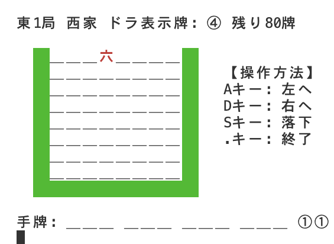
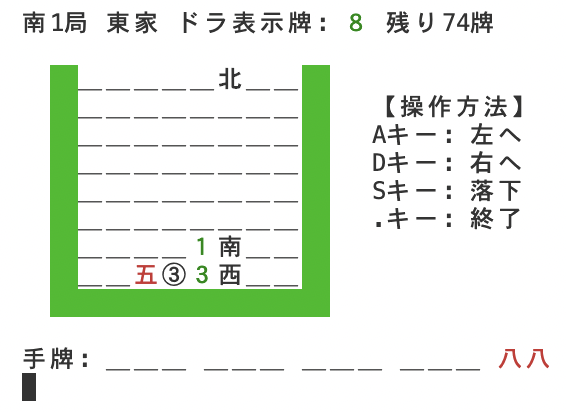
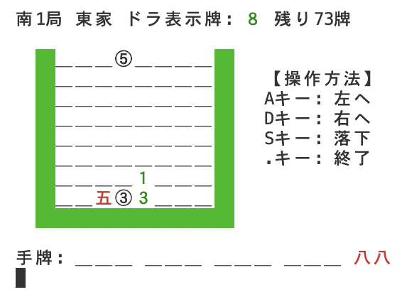

[](https://classroom.github.com/open-in-codespaces?assignment_repo_id=9463442)
# [week7_2](https://eeic-software1.github.io/2022/week7/#week7_2)

## このゲームについて
本ゲームは、ソフトウェアⅠWeek7-2自由課題です。メンバーは、
- 高橋淳一郎(YamadaQuantum)
- 山内悠理子(yuriko0505)
- 佐藤龍吾(SugarDragon5)

です。

**落ちゲー×麻雀**をテーマにしており、落ちてくる麻雀牌を揃えて消して、強い手牌を目指します。ディースリー・パブリッシャー社の『THE麻雀落ちゲー 〜落雀〜 SIMPLE 1500 シリーズ Vol.46』を参考にしました。

## 遊び方
### 実行方法
(本ゲームはMac, Win10+WSL2, **Github CodeSpaces**で動作することは確認済みである。)
(※ 2023/10/09 変更)

以下のコマンドで実行する(makeが入っている前提)。
```
$ make run
```

実行ファイルの生成のみを行いたい場合は、単に
```
$ make
```

生成されたファイルを消去したい場合は
```
$ make clean
```
で元通りになる。

### ゲームのルール
- 8×8のフィールドに、1つずつ麻雀牌が落ちてくる。AキーDキーで左右に動かし、Sキーで下に積みあげていく。
    <p></p>
- 左右方向に5回移動するごとに、1マス分下に落ちていく。
- 落ちてくる麻雀牌は次の四種類からなる
    + 萬子: 赤色漢数字の牌
    + 筒子: 丸囲み数字の牌
    + 索子: 緑色全角数字の牌
    + 字牌: 東南西北の風牌と、白發中の三元牌
    <p></p>
- 同じ種類の牌が一直線(タテ or ヨコ)に3つ連なると消える。
    + 4つ以上が一直線に連なった場合は、左側(上側)の3つだけが消える
    <p></p>
- 消えた3つの牌が以下の条件のいずれかを満たしたとき、画面下側の「手牌」に入る。この3つ組を面子と呼ぶ。
    + 条件1(順子): 3つの牌が数牌(字牌以外)であり、その最小のものを $n$ としたとき、あと2つが $n+1, n+2$ である。
        - ②③④、七八九など
        - 八九一などはダメ
    + 条件2(刻子): 3つの牌がすべて同じである。
        - ②②②、七七七、東東東など
    <p></p>
- 手牌が面子4つ(計12牌)と雀頭(ゲーム開始時にランダムに決定される同じ牌2個)の計14牌になったら和了となりゲームが終了し、役・得点(後述)が計算される。過去の結果はタイトルからRキーを押すことで入ることができるスコアランキング画面からみることができる。

### 実装されている役・得点計算式
成立条件は[ここ](http://mjall.jp/t0001/)などを見てください。

|翻数|役リスト|
|---|---|
|一翻役|立直、門前清自摸和、一発、役牌(自風・場風・三元牌)、断么九、平和、一盃口、ドラ|
|二翻役|三色同順、三色同刻、一気通貫、三暗刻、混全帯么九、小三元、混老頭|
|三翻役|二盃口、純全帯么九、混一色|
|六翻役|清一色|
|役満(13翻相当)|四暗刻、大三元、緑一色、字一色、清老頭、小四喜、大四喜、九蓮宝燈|

得点計算は[Wikipedia](https://ja.wikipedia.org/wiki/%E9%BA%BB%E9%9B%80%E3%81%AE%E5%BE%97%E7%82%B9%E8%A8%88%E7%AE%97)の計算式を参照した。

### その他注意すべきルール
- 場・家があります。役牌・平和の計算に用いられます。
- ドラ・裏ドラがあります。裏ドラは上がるまで見ることが出来ません。
- 80牌操作して和了出来なかった場合はゲームオーバーとなります。
- 鳴きはありません。常に立直門前清自摸和扱いとなります。
- 一発の条件は「立直状態(3面子揃った状態)になってから最初に消した牌で和了する」です。
- 役満成立時、役満以外の役は計上されません。

## FAQ
### 「指定されたパスが見つかりません。Error」とでて遊べないんだけど！！
このゲームではWindows環境をサポートしていません。別の環境で実行してください。

### 文字化けするんだけど！！
別の環境で実行してください。

### 筒子が出てくると文字がズレるんだけど！！！
別の環境で実行してください。同じWSLでも、VSCode内のターミナルだとうまく動いて、それ以外だと動かないという現象を確認しています…。

丸囲み数字は半角幅で表示される環境と、全角幅で表示される環境があり、このプログラムでは半角幅で表示される環境を想定して丸囲み数字の後に半角スペースを挟んでいます。
そのため全角幅で表示される環境でこのゲームを遊ぼうとすると、筒子の右に空白が差し込まれ、盤面が歪んでしまうことがあります。

### この役の判定バグってない？
ありえます。JudgeTestというディレクトリに、好きな手牌にたいしてどのような役と得点になるかをテストできる環境があるので再度実行し、間違った結果が再現したら報告してください。

### ランキング表示がどうなってるかみたいんだけど、あんまプレイしたくない！
そんな忙しいあなたのために、score_sample.txtに佐藤のプレイ履歴を載せてあるので、これをscore.txtにリネームしてあげてください。

## 役割分担
- 原案・骨格実装: 佐藤
- 落ちゲー処理: 高橋
- 描画: 佐藤
- 役判定・点数計算: 山内
- その他諸々: 思いついた人/暇な人
